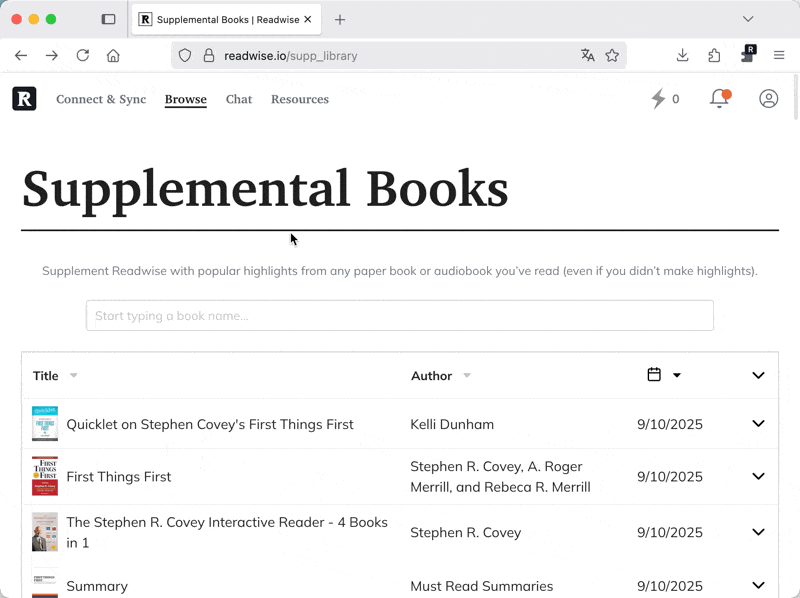

FF Readwise Translator

An open-source browser extension that adds an inline “Translate (XX)” button to Readwise highlights on `https://readwise.io/bookreview/`. Translate the editable highlight text to your preferred language using Gemini, OpenAI, or OpenRouter.

Features
- Inline translate button on Readwise edit view
- Multiple providers: Gemini, OpenAI, OpenRouter
- Custom target language code (ISO 639-1, e.g., en, tr, de)
- Per-provider API keys stored locally in your browser
- Small control panel opened from the toolbar button (badge “R”)

Demo
Quick demo of translating a Readwise highlight:

Providers and Models
- Gemini: gemini-1.5-flash
- OpenAI: gpt-4o-mini
- OpenRouter: openai/gpt-4o-mini

Permissions
- `activeTab`, `storage`, `scripting`
- Host permissions:
  - `https://generativelanguage.googleapis.com/*` (Gemini)
  - `https://api.openai.com/*` (OpenAI)
  - `https://openrouter.ai/*` (OpenRouter)

Installation
Firefox (Temporary Add-on)
1. Open `about:debugging#/runtime/this-firefox`
2. Click “Load Temporary Add-on…” and select the `manifest.json` in this folder
3. You should see a toolbar button with an “R” badge

Chromium/Chrome (Unpacked)
1. Open `chrome://extensions`
2. Enable “Developer mode”
3. Click “Load unpacked” and select this folder

Usage
1. Click the toolbar button to open the control panel
2. Select Provider (Gemini, OpenRouter, or OpenAI)
3. Paste the corresponding API key
4. Enter your target language code (ISO 639-1, e.g., `en`, `tr`, `de`). A reference list is available here:
   https://en.wikipedia.org/wiki/List_of_ISO_639-1_codes
5. Click Save
6. Go to `https://readwise.io/bookreview/`, open a highlight in edit mode
7. Click the “Translate (XX)” button next to Save; the text is translated in place

Notes
- Keys and settings are saved locally via `chrome.storage.local`
- The extension observes the DOM to attach buttons to dynamically loaded highlights
- You can delete a stored key per provider from the control panel

Development
- No build steps required; files are plain JS/HTML/CSS
- Key files:
  - `manifest.json`: Extension manifest (Firefox-compatible background script)
  - `background.js`: Sets a simple “R” badge on the action icon
  - `popup.html` / `popup.js`: Control panel for provider, API key, and language
  - `content.js`: Injects the translate button and calls the selected provider

Security & Privacy
- API keys are stored locally on your machine via browser storage
- Requests are sent directly from the content script to the selected provider API over HTTPS
- No usage analytics or external calls beyond the chosen provider

License
This project is intended to be open source under the MIT License.
If you want, we can add a `LICENSE` file to the repository explicitly.
